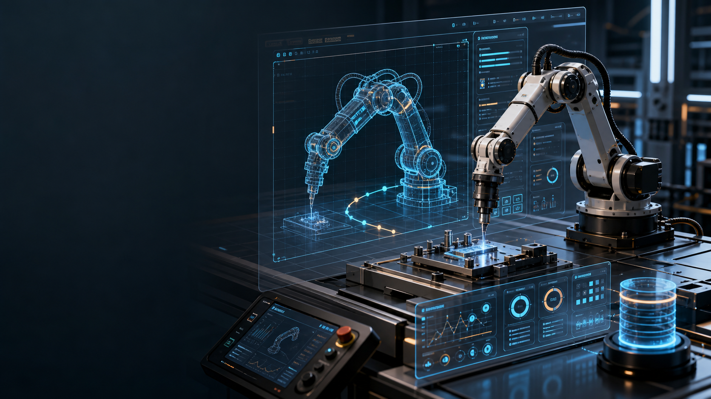

# CyberYuan RobotMatrix

CyberYuan RobotMatrix 是面向工业机器人上位控制、数字孪生和协作场景调试的软件层。它帮助开发者在 Unity 和 C# API 中统一管理机械臂模型、运行时控制、交互输入、运动指令、轨迹数据和外部算法融合。

RobotMatrix 的目标不是替代真实运动控制卡，而是在仿真、算法验证、协作场景调试和数字孪生阶段，为开发者提供一个可配置、可记录、可扩展的上位控制基础。


## 解决的问题

工业机器人调试往往高度依赖机械臂内部运动控制卡。只要控制链路被硬件和厂商工具锁住，开发者在融合视觉、规划、优化、数据库、协作交互或数字孪生算法时，就很难拥有完整的控制权。

RobotMatrix 面向这些场景：

- 在 Unity 中构建可交互、可调试、可记录的机械臂数字孪生。
- 用统一接口管理 FK、IK、运动指令、交互输入和场景同步。
- 为协作机械臂、非标工站和智能制造算法验证提供更高灵活度。
- 将运动数据录制、轨迹清洗、数据库桥接和后续算法融合放进同一个体系。

## 算法与设计亮点

RobotMatrix 的算法设计重点是稳定、可调、适合协作场景，而不是只追求单次求解结果。

| 设计能力 | 价值 |
|----------|------|
| 加权 IK 求解 | 在位置、姿态、阻尼、关节权重之间建立可调平衡，适合不同机械臂和末端任务 |
| 关节限位保护 | 关节接近软限位时自动提高约束强度，减少越界、贴边和不自然姿态 |
| 多解搜索与择优 | 在多个候选解中综合连续性、关节偏好、限位风险和奇异风险，选出更适合执行的解 |
| 零空间中位回归 | 在仅位置控制或冗余空间中，引导关节回到更舒展、更可继续运动的区间 |
| 奇异场景稳定化 | 对接近奇异或停滞的姿态进行自适应阻尼与定向扰动，降低跳动和卡死概率 |
| 关节运动偏好 | 可配置每个关节参与运动的优先级，让协作场景和特定机械臂形态更自然 |
| 运动指令与 S 曲线 | MoveJ、MoveL、MoveC 支持速度、加速度、减速度、Jerk 和 Zone 融合参数 |
| 数据闭环 | 支持录制、持久化、数据库桥接、轨迹清洗和可执行轨迹生成 |

这些能力都通过 Inspector 参数和 C# API 暴露给用户。README 只说明设计目标和可调方向，不展开内部求解流程和核心实现细节。



## 模块组成

| 模块 | 定位 |
|------|------|
| `RobotMatrix.Kinematics` | FK / IK / 关节模型 / 求解结果数据 |
| `RobotMatrix.Controller` | 机械臂控制器、层级分析、运行时控制调度 |
| `RobotMatrix.Runtime` | Unity MonoBehaviour 集成、数据库桥接、录制与恢复流程 |
| `RobotMatrix.Interaction` | 输入处理、命令分发、关节与 TCP 交互命令 |
| `RobotMatrix.VirtualSimulation.Instructions` | MoveJ / MoveL / MoveC 指令、速度规划、路径参数 |
| `RobotMatrix.VirtualSimulation.IO` | 虚拟 IO、连接状态、电源状态和等待调度 |
| `RobotMatrix.TrajectoryCleaner` | 原始轨迹清洗、标定、可执行轨迹生成与数据库配置 |
| `RobotMatrix.Data` | Inspector 可序列化配置 |
| `RobotMatrix.Editor` | 自定义 Inspector 与编辑器工具 |

## 依赖

请先安装 BaseToolkit，再安装 RobotMatrix。

BaseToolkit 发布仓库：[Yuan5520/BaseToolkit_Release](https://github.com/Yuan5520/BaseToolkit_Release)

RobotMatrix 使用 BaseToolkit 提供的 `RobotMatrix.Math`、`IEngine`、`Collision`、`Persistence`、`Recorder`、`DBManager` 和 `BaseToolkit.TaskPool` 等基础能力。

## 安装顺序

1. 将 BaseToolkit 发布包导入 Unity 项目。
2. 将 RobotMatrix 发布包导入同一个项目。
3. 确认 `Plugins/RMLicense/RMLicense.dll` 存在。
4. 在 Unity 菜单中打开 `CyberYuan > RM License > Activate` 激活授权。
5. 等待 Unity 完成 DLL 导入和程序集刷新。

## Unity 挂载方法

RobotMatrix 要求机械臂各轴 Transform 必须构成真实运动链的父子级关系。也就是说，基座是第 0 轴的父级，第 0 轴是第 1 轴的父级，第 1 轴是第 2 轴的父级，依此类推直到末端 TCP。`Joint Transforms` 不是一组互不相干的空物体引用；如果各轴不是父子级链路，FK、IK、Scene 轴向编辑、碰撞分段和 TCP 保持都会得到错误的空间关系。

推荐挂载流程：

1. 在场景中整理机械臂模型层级，确保各轴按真实机构从基座到末端逐级嵌套。
2. 在机械臂根节点或独立控制节点上添加 `RobotArmBehaviour`。
3. 展开 Inspector 的 `关节配置` 面板。
4. 将每个关节轴 Transform 按运动学顺序拖入 `关节 Transform 列表`：`Element 0` 是第 1 轴，`Element 1` 是第 2 轴，依此类推。
5. 将 TCP 或工具末端 Transform 拖入 `末端执行器 Transform`。
6. 点击 `同步配置数组长度`。这一步会按关节数量同步 `关节参数配置`、IK 每轴运动偏好和碰撞体覆盖数组，建议每次增删关节后都先点一次。
7. 在 `关节参数配置` 中逐个检查关节名称、类型、DH 参数、旋转轴、限位、初始角度、最大速度和加速度。
8. 使用 `编辑轴向&范围` 进入交互式轴配置，在 Scene 视图中选择旋转轴并拖动限位范围。
9. 在 `IK Config` 中先使用默认参数启动，确认 FK 和 IK 都能运行后，再按机械臂表现逐步调参。
10. 在 `运行时参数` 中确认默认速度：FK `30 deg/s`、IK 移动 `0.2 m/s`、IK 旋转 `45 deg/s`、插值最大角速度 `60 deg/s`。
11. 进入 Play Mode，通过键盘、鼠标、Scene 手柄或 C# API 控制机械臂。

推荐先使用仓库中的示例场景验证授权和基础控制，再迁移到自己的机器人模型。

## 关节层级要求

正确结构示例：

```text
RobotRoot
└── Joint_0_Base
    └── Joint_1_Shoulder
        └── Joint_2_Elbow
            └── Joint_3_WristPitch
                └── Joint_4_WristYaw
                    └── Joint_5_WristRoll
                        └── TCP
```

需要特别注意：

- `Joint Transforms` 的顺序必须和父子级链路顺序一致。
- 每个关节 Transform 的位置应代表该关节旋转中心。
- TCP 最好是末端工具坐标系的 Transform，而不是随便放在模型末端的可视网格。
- 不建议把所有轴 Transform 平铺在同一个父节点下；这会破坏每一级关节旋转对后续关节的影响。
- 如果模型资源本身不是父子级机械臂结构，建议先建立一套空物体关节骨架，再把网格模型挂到对应关节下面。

## 一键配置与交互式轴设置

`RobotArmBehaviour` 的自定义 Inspector 提供了适合初次挂载的配置流程：

1. 在 `关节 Transform 列表` 中拖入所有关节 Transform。
2. 点击 `同步配置数组长度`。这相当于基础一键配置，会自动创建或补齐每个关节的 `SerializableJointConfig`。
3. 检查每个关节的名称。默认会使用 Transform 名称，建议保持清晰，如 `J1_Base`、`J2_Shoulder`。
4. 点击某个关节行右侧的 `编辑轴向&范围`。
5. 在 Scene 视图中会出现 R/G/B 轴向箭头，点击与你真实关节旋转方向一致的轴。
6. 选中轴后会显示蓝色旋转范围扇形。
7. 拖动弧线两端的蓝色箭头设置最小/最大限位；拖动时箭头会变黄，松开后自动写回配置。
8. 如果配置错误，可以再次点击轴箭头或拖动限位重新设置；按 `Esc` 可以取消当前拖拽。
9. 所有关节配置完成后，进入 Play Mode，用 FK 模式逐轴转动确认方向和限位。
10. FK 正常后再切换到 IK，测试 TCP 平移和旋转。

## Inspector 参数设置建议

| 区域 | 建议 |
|------|------|
| 关节 Transform 列表 | 必须按父子级运动链顺序填写，不能乱序 |
| 末端执行器 Transform | 推荐使用 TCP 空物体，位置和朝向代表工具坐标系 |
| 关节参数配置 | 先用 `同步配置数组长度` 生成，再逐个设置 DH、轴向、限位、初始角 |
| 轴向 & 旋转范围编辑 | 用 Scene 视图交互式选择轴向和拖动限位，适合初次配置 |
| IK 配置 | 默认参数适合 6 轴工业臂调试；遇到困难姿态时再提高迭代或调整阻尼 |
| 加权 DLS | 建议保持开启，用于限位附近的稳定控制 |
| 零空间中位回归 | 适合让机械臂在仅位置控制时保持更舒展的姿态 |
| 多解搜索 | `Multi Solution Trials` 越高，候选解质量越好，但计算量也越高 |
| 奇异处理 | 建议保持自适应阻尼和定向扰动开启 |
| 运行速度 | 插值最大角速度应高于 FK/IK 角速度，避免松开按键后继续补运动 |
| 坐标系 | IK 增量默认使用 TCP 坐标系，适合末端局部方向的手动调试 |

完整参数说明见 [RobotMatrix_Inspector_Parameters.md](docs/RobotMatrix_Inspector_Parameters.md)。

## 键盘交互

默认键盘输入开启后，可在 Play Mode 中快速调试：

| 操作 | 默认按键 |
|------|----------|
| FK/IK 模式切换 | `Tab` |
| 选择上一个/下一个关节 | `Q` / `E` |
| FK 当前关节正反向旋转 | `D` / `A` |
| IK 平移 X/Z | `A` `D` / `W` `S` |
| IK 平移 Y | `Space` / `Left Ctrl` |
| IK 旋转 | `U` `I` `O` `J` `K` `L` |
| IK 增量坐标系 | `1` World, `2` Base, `3` TCP |

如果你的项目有自己的输入系统，可以关闭键盘输入，只保留 `RobotArmController` API。

## API 使用

最常见的入口是场景中的 `RobotArmBehaviour`：

```csharp
using RobotMatrix.Controller;
using RobotMatrix.Math;
using RobotMatrix.Runtime;

public class RobotJogExample : UnityEngine.MonoBehaviour
{
    public RobotArmBehaviour robot;

    private void Start()
    {
        robot.Controller.SetControlMode(ControlMode.IK);
    }

    private void Update()
    {
        var deltaPosition = new RMVector3(0.001f, 0f, 0f);
        var deltaRotation = RMVector3.Zero;
        robot.Controller.MoveEndEffectorDelta(deltaPosition, deltaRotation);
    }
}
```

设置单个关节角度：

```csharp
using RobotMatrix.Math;

int jointIndex = 0;
float angleDeg = 15f;
robot.Controller.SetJointAngle(jointIndex, angleDeg * RMMathUtils.Deg2Rad);
```

使用 MoveJ 指令：

```csharp
using RobotMatrix.Math;
using RobotMatrix.VirtualSimulation.Instructions;

robot.Controller.EnqueueMoveJ(new MoveJointParams
{
    TargetJointAngles = new float[]
    {
        0f,
        -30f * RMMathUtils.Deg2Rad,
        45f * RMMathUtils.Deg2Rad,
        0f,
        30f * RMMathUtils.Deg2Rad,
        0f
    },
    SpeedPercent = 50f
});
```

使用 MoveL 指令：

```csharp
using RobotMatrix.Math;
using RobotMatrix.VirtualSimulation.Instructions;

robot.Controller.EnqueueMoveL(new MoveLinearParams
{
    TargetPosition = new RMVector3(0.45f, 0.1f, 0.25f),
    TargetRotation = RMQuaternion.Identity,
    TCPLinearSpeed = 0.2f,
    TCPAngularSpeed = 45f * RMMathUtils.Deg2Rad
});
```

## 调参建议

1. 先确认机械臂模型、关节顺序、轴向和限位，再调 IK 参数。
2. 如果末端位置容易到但姿态抖动，先降低 `Rotation Weight` 或提高阻尼。
3. 如果机械臂靠近关节限位，优先调整软限位区域、限位惩罚和关节偏好。
4. 如果困难姿态附近卡住，适当提高迭代次数，保持奇异处理开启。
5. 如果动作不连续，增加多解搜索次数，并调整运动偏好和突变惩罚。
6. 如果松开键盘后仍然继续运动，确认插值最大角速度高于 FK/IK 角速度。

## 注意事项

- `RobotArmBehaviour` 初始化前需要完整填写关节 Transform；顺序必须与运动学链一致。
- Inspector 中速度多以 `deg/s` 或 `m/s` 表示，底层 API 中关节角通常使用弧度。
- MoveL、MoveC 的 TCP 目标位置按 DH 基坐标系解释，不是随意的屏幕坐标。
- 当前 Inspector 默认使用同步 IK 计算，适合大多数调试和发布场景。
- 复杂模型建议先在示例场景验证，再迁移到真实项目。
- License 未激活时，受保护的运动学 API 不会正常工作。
- 如果同时导入源码版和 DLL 版，Unity 可能出现重复程序集或类型冲突；发布项目建议只使用 DLL 发布包。

## 常见问题

`MissingMethodException: RMMatrixMN.SymmetricAATInto` 通常表示 RobotMatrix 已更新，但 BaseToolkit 中的 `RobotMatrix.Math.dll` 仍是旧版本。请同步更新 BaseToolkit Release 包，确保 `RobotMatrix/Math/RobotMatrix.Math.dll` 与当前 RobotMatrix DLL 同一批次发布。

## License

首次使用需要激活 RobotMatrix License。请在 Unity 菜单中打开：

```text
CyberYuan > RM License > Activate
```

如果同时安装 BaseToolkit、RobotMatrix、RealDrive，可使用：

```text
CyberYuan > License Overview
```

查看统一授权状态。

## 适用人群

- 智能制造、机器人、自动化相关开发者和研究者。
- 需要搭建机械臂数字孪生或上位控制软件的工程团队。
- 需要在 Unity 中融合机器人规划、视觉、数据库和交互逻辑的项目。
- 希望摆脱单一厂商调试工具限制、构建自有机器人软件栈的团队。
